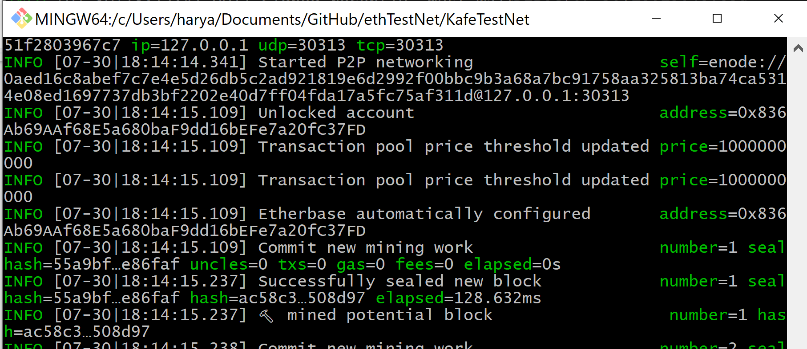
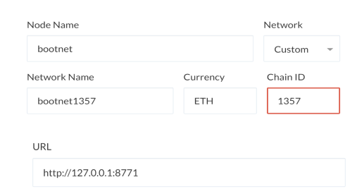

# BOOTNET: A PRIVATE `PROOF OF AUTHORITY` TESTNET BLOCKCHAIN NETWORK
---

## SETUP INSTRUCTIONS
---

### 1. Create Two Nodes
* Open a terminal window and run the following command

> #### Create the node called `n1`
* Open a terminal window, run the following command:

```bash
geth account new --datadir n1
```
* give password (my n1 password: `aaaa`)
* copy the address that is printed out in the command terminal to a notepad (my n1 address. 7cf33722ba53f3db7a5bbd5f63e1ea6f6383456b)
* store the password in a file called password.txt

> #### Create the node called `n2`

* Open a terminal window, run the following command:

```bash
geth account new --datadir n2
```
* give password (my n2 password: `bbbb`)
* copy the address that is printed out in the command terminal to a notepad (my n2 address 1faed873dd18db0e5b2ddd7e7399e3d28d8880fe)
* store the password in a file called passnode2.txt


### 2. Create Genesis Block
* Open a terminal window, navigate to where you downloaded geth run the following command:

 ```bash
 ./puppeth
 ```
* Type in the network name "bootnet" and hit enter to move forward in the wizard.
* Type `2` to pick the `Configure new genesis` option, then `1` to `Create new genesis from scratch`:
* Type `1` to choose `Proof of Work` and continue.
* Copy and paste an address from the one of the two nodes you had created before without the `0x` prefix hit enter .
* Copy and paste an address from the second of the two nodes you had created before without the `0x` prefix hit enter.
* You will be asked to enter a pre-fund account.

* Copy and paste an address from your Ethereum wallet in MyCrypto, without the `0x` prefix (my prefunded address: 0x59e89683BD9FcAEea66843De01F3a13e842CBD20). hit enter
* hit enter again on the blank `0x` address to continue the prompt.
* Continue with the default option for the prompt that asks `Should the precompile-addresses (0x1 .. 0xff) be pre-funded with 1 wei?` by hitting enter again,
* Follow the prompt and continue until you reach the `Chain ID` prompt.
* Enter the `1357` as the chain ID, then hit enter.
* You should see a success message and redirected to the menu
* From the menu type `2` which is `Manage existing genesis` and hit enter.
* Then, type `2` again to choose the `Export genesis configurations` option, and give the directory location `bootnet_config`
* This will export `bootnet.json` file in `bootnet_config` folder -- delete files with with any other suffixes we just need `bootnet.json` file.
* Exit `puppeth` by using the `Ctrl+C` keys combination.

* ##### bootnet.json should look something like this:


### 3. Initialize the two nodes with the config file to use the genesis block

> node n1
```bash
geth init bootnet_config/bootnet.json --datadir n1
```
You should see this success message:


>node n2
```bash
geth init bootnet_config/bootnet.json --datadir n2
```
You should see this success message:


### 4. Create a separate Bootnode (CHALLENGE ACCEPTED), dedicating th connecting peers together

* In the terminal type the below command it will create a `boot_bootnet.key` file with boot address

```bash
./bootnode.exe -genkey boot_bootnet.key
```


## LAUNCH THE CHAIN
---

### 1. START BOOTNODE:

* Go to KafeTestNet folder: `cd KafeTestNet`
* Run the bootnode with the `boot_bootnet.key` created before 

```bash
 ~/Blockchain-Tools/bootnode.exe -nodekey boot_bootnet.key -verbosity 9 -addr :30310
```
This writes the enode address in the terminal
* Copy the enode address:

```
my enode generated:
enode://219719579d0d81b9e6f56ff4addd8ddaaa907a7e86699f02901f38a2accbdff520c2748a133b464f64902d861eb74611c934ecf0368acd39d09a66b85ad748ac@127.0.0.1:0?discport=30310
```

### 2. START N1 NODE:
* Open the terminal and type the following command:

```bash

geth --datadir n1/ --syncmode 'full' --port 30311 --rpc --rpcport 8771 --bootnodes 'enode://219719579d0d81b9e6f56ff4addd8ddaaa907a7e86699f02901f38a2accbdff520c2748a133b464f64902d861eb74611c934ecf0368acd39d09a66b85ad748ac@127.0.0.1:0?discport=30310' --networkid 1357 --gasprice '1' -unlock '7cf33722ba53f3db7a5bbd5f63e1ea6f6383456b' --password password.txt --mine --allow-insecure-unlock

```

### 3. START N2 NODE:
* Open the terminal and type the following command:

``` bash

geth --datadir n2/ --syncmode 'full' --port 30312 --bootnodes 'enode://219719579d0d81b9e6f56ff4addd8ddaaa907a7e86699f02901f38a2accbdff520c2748a133b464f64902d861eb74611c934ecf0368acd39d09a66b85ad748ac@127.0.0.1:0?discport=30310' --networkid 1357 -unlock '1faed873dd18db0e5b2ddd7e7399e3d28d8880fe' --password passnode2.txt --mine --allow-insecure-unlock --ipcdisable 

```


##  ADD A NEW SEALER ADDRESS ON THE FLY
---

> #### Create a new node `n3` running below command in the terminal

* Open a terminal window, run the following command:

``` bash
~/Blockchain-Tools/geth.exe account new --datadir n3
```

* give password (my n3 password: `cccc`)
* copy the address that is printed out in the command terminal to a notepad (my n2 address 836Ab69AAf68E5a680baF9dd16bEFe7a20fC37FD)
* store the password in a file called `passnode3.txt`

* Copy the address of n3 in the `bootnet_config/bootnet.json` file in the extradata section after both sealer addresses like so:


* Initialize the new sealer

```bash
~/Blockchain-Tools/geth.exe init bootnet_config/bootnet.json --datadir n3
```

* Run the new node `n3`

```bash
~/Blockchain-Tools/geth.exe --datadir n3/ --syncmode 'full' --port 30313 --bootnodes 'enode://219719579d0d81b9e6f56ff4addd8ddaaa907a7e86699f02901f38a2accbdff520c2748a133b464f64902d861eb74611c934ecf0368acd39d09a66b85ad748ac@127.0.0.1:0?discport=30310' --networkid 1357 -unlock '836ab69aaf68e5a680baf9dd16befe7a20fc37fd' --password passnode3.txt --mine --allow-insecure-unlock --ipcdisable 
```


* Check to see if the Bootnode added the third node or not


---

## UNDERSTAND THE CONFIGURATION

* chain ID: 1357 (used for transaction replay attack protection)
* Blocktime: 5 seconds (--while creating gensis block) since its a private network 5 sec. should be plenty
* rpc Port: 8771 Connecting port so that MyCrypto and talk to our `bootnet`
* url: http://127.0.0.1:8771 (As we are running MyCrypto as a desktop app we don't care about ssl)
* Network listening port: bootnode: 30310, n1: 30311, n2: 30312, n3: 30313 (Should be different for each node so they connect to bootnode via `enode://...`)


## CONNECT MyCrypto TO OUR PRIVATE NETWORK (BOOTNET)
---

* 1. Go to MyCrypto on the bottom right click on `Change Network`
* 2. Opens all the network, scroll all the way at the bottom and click on `Add Custom Node`
* 3. Click on the dropdown `Network` scroll all the way at the bottom and click on `custom`
* 3. Add the network name, port, coin_type, and url like below:



* To check if its connected successfully or not you can go click on `Change Network` in the bottom right of MyCrypto and you should see the network successfully connected:


## SEND A SUCCESSFUL TRANSACTION
---

* ### Open the Wallet of a prefunded account and send 1 ETH another address and click `Send Transaction`:


* ### Nodes should seal the transaction:


* ### MyCrypto should get a status of Success if you click on the TX Status


 


